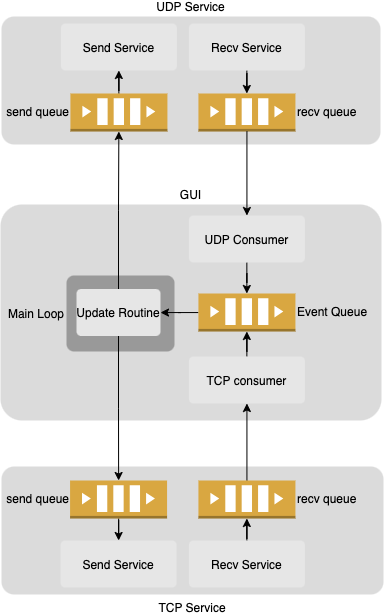

# Tic-Tac-Toe Demo
This project is the result of a team effort to develop a Tic-Tac-Toe game demo featuring both TCP and UDP socket servers, along with two GUI-based dummy clients. It demonstrates a modular and scalable architecture for multiplayer communication and gameplay, emphasizing clean separation of concerns and real-time interaction.
## Features
* **Decoupled Architecture**  
  Follows the Producer-Consumer design pattern for cleaner separation of concerns.
* **TCP and UDP Support**  
  Includes both TCP and UDP socket servers with scalable infrastructure.
* **Server-side Caching**  
  Maintains in-memory statistics for player matches.
* **In-game Messaging**  
  Enables real-time message exchange between players.
* **Responsive GUI**  
  Interactive and intuitive graphical interface for the client-side gameplay.
## Design
1. System design  

2. Client  

3. TCP Server  

4. UDP Server  

## Running Instructions
1. In `tcp.py`, set the host IP and port for the TCP server, and determine client identification strategy. Statistics tracking will be affected by this decision. `IP_ONLY_IDENTIFIER = True` is recommended if clients are running on multiple machines. 
2. Start the TCP server by running `tcp.py`.
3. In `udp.py`, configure the host IP and port for the UDP server.
4. Start the UDP server by running `udp.py`.
5. In `client1.py`, specify the host IP and client-side port, and determine if client TCP socket needs to bind to a dedicated client port. Statistics tracking will be affected by this decision. It's recommended to pass `None` to `port_tcp_client` if clients are running on multiple machines.
6. Launch the first dummy client using `client1.py`.
7. In `client2.py`, configure the host IP and port similarly.
8. Launch the second dummy client using `client2.py`.
## Important Note
The TCP server caches user statics, but the data is not persisted. There are two options for setting up client identifier for statistics caching:
1. **If running all servers and clients on localhost (same machine)**  
    Set `IP_ONLY_IDENTIFIER = False` and assign a user-specified value to `CLIENT_TCP_PORT`. Each client is identified by socket **address (IP, PORT)**.  
    Note: This setup may raise "OSError: [Errno 48] Address already in use" when attempting to initiate a new game
    after one has ended. This occurs because a recently closed socket may still be in the TIME_WAIT state, preventing
    the same address from being rebound immediately. 
2. **If running all servers and clients on different machines within a LAN**  
    Set `IP_ONLY_IDENTIFIER = True` and `CLIENT_TCP_PORT = None`. Each client is identified by socket **IP**.  
    This is the recommended configuration, as it avoids port conflicts by relying solely on the client's IP address for identification.